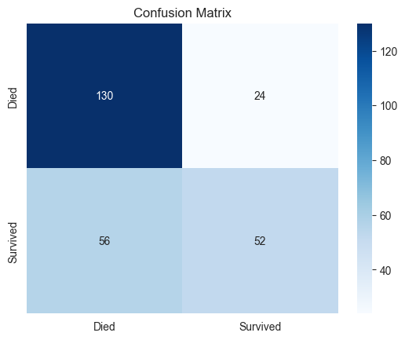
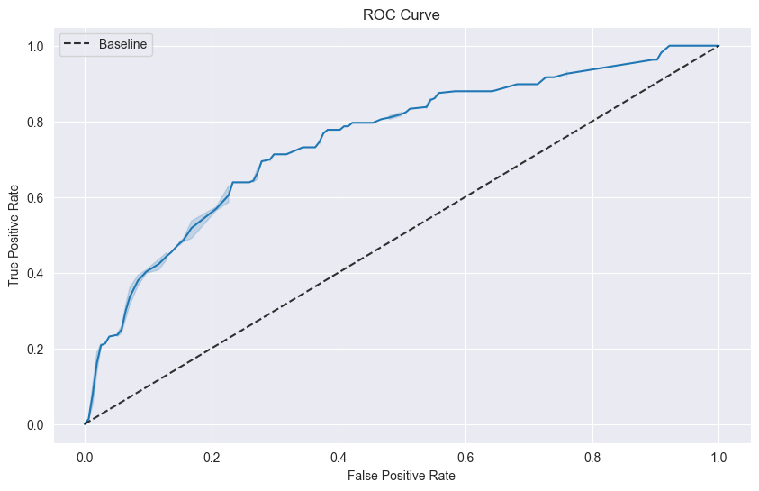

# Titanic Survival Prediction

This project uses logistic regression to predict survival on the Titanic based on data about the passengers. The data is from the [Titanic: Machine Learning from Disaster](https://www.kaggle.com/c/titanic) competition on Kaggle.

## Table of Contents

- [Project Description](#project-description)
- [Getting Started](#getting-started)
- [Dependencies](#dependencies)
- [Data](#data)
- [Usage](#usage)
- [Results](#results)
- [Conclusion](#conclusion)

## Project Description

The project aims to predict whether a passenger on the Titanic would have survived or not, given features such as age, gender, class, and fare.

## Getting Started

To get started, you can clone this repository:

```
git clone https://github.com/erik172/titanic-survival-prediction
```


Then, install the dependencies:

```
pip install -r requirements.txt
```


## Dependencies

- pandas
- numpy
- seaborn
- matplotlib
- scikit-learn

## Data

The data for this project is available on Kaggle: [Titanic: Machine Learning from Disaster](https://www.kaggle.com/c/titanic).

## Usage

To run the logistic regression model, simply open the `Titanic_Survival_Prediction.ipynb` notebook and run all cells. Then, to test the model on new data, modify the `sample_passengers` array in the "Titanic Survival Prediction" section of the notebook.

## Results

The model achieved an accuracy of 69% on the test set, with a ROC AUC score of 0.751. The confusion matrix is shown below:



The classification report is as follows:

```
              precision    recall  f1-score   support

           0       0.70      0.84      0.76       154
           1       0.68      0.48      0.57       108

    accuracy                           0.69       262
   macro avg       0.69      0.66      0.66       262
weighted avg       0.69      0.69      0.68       262
```

The confusion matrix and ROC curve are included in the results directory. The ROC curve is shown below:



## Conclusion

In this project, logistic regression was used to predict survival in Titanic, achieving an accuracy of 69%. Analysis of the confusion matrix and the precision, recall and F1-score metrics showed that the model performed better in class "0" (did not survive) classification compared to class "1" (survived). In addition, the ROC AUC score metric, which measures the model's discrimination ability, was 0.75, indicating moderate performance on the classification task.

Although a significant result was achieved, there is still room for improvement in the model. Different feature selection techniques can be explored, such as removing redundant features or including new relevant features. In addition, other machine learning algorithms, such as decision trees or neural networks, can be tested to compare and further improve the model performance.